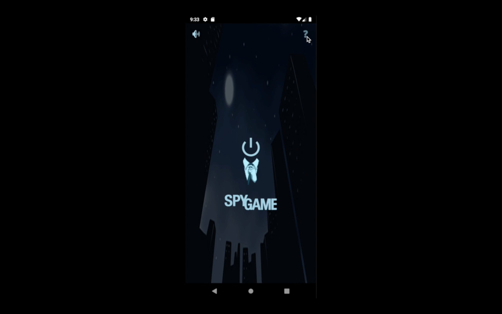

# Spy-Game
*Main Menu*

*Spy Card*

## Description

**Spy Game** is an interactive multiplayer experience designed for three or more players. In this digital card play, each player virtually selects a role card. Those assigned the role of a "spy" must employ their deductive skills to uncover the identities of their fellow players, while the remaining participants work together to identify the spy. This all unfolds through in-game conversations, with the twist that nobody knows the roles of others, creating an atmosphere of intrigue and suspense.

## Features

- **Customization:** Tailor the game to your preferences by adjusting the number of players and the quantity of spy cards.

- **Spy Music:** Enjoy an immersive gaming experience with a captivating spy-themed soundtrack.

- **Diverse Categories:** Explore a variety of themed categories, adding depth and excitement to the gameplay.
